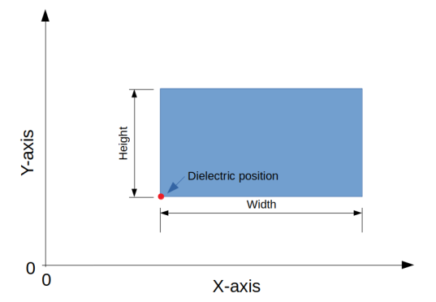

<p align="center">
  <h3 align="center">Scattering from Dielectric Objects with FDTD</h3>
</p>
<details open="open">
  <summary>Table of Contents</summary>
  <ol>
    <li>
      <a href="#about-the-project">About The Project</a>
      <ul>
        <li><a href="#built-with">Built With</a></li>
      </ul>
    </li>
    <li>
      <a href="#getting-started">Getting Started</a>
      <ul>
        <li><a href="#prerequisites">Prerequisites</a></li>
        <li><a href="#installation">Installation</a></li>
      </ul>
    </li>
    <li><a href="#usage">Usage</a></li>
      <ul>
        <li><a href="#command-line-interface">Command Line Interface</a></li>
        <li><a href="#python-script">Python Script</a></li>
      </ul>
    <li><a href="#contributing">Contributing</a></li>
    <li><a href="#license">License</a></li>
    <li><a href="#contact">Contact</a></li>
  </ol>
</details>

## About The Project

Finite-Difference Time-Domain (FDTD) is a numerical analysis technique to approximate the solutions of Maxwell's differential equations at discrete points in space in the time domain.

This repository contains an implementation of this technique in a 2D PEC bounded enclosure through which the scattering of EM waves from dielectric objects can be investigated.


Given the above situation, the discretized update equations are given by:


Where E describes the electric field, H the magnetic field and I the current strength of a point source in the enclosure. These equations are implemented in the FDTD function in [space.py](./space.py).

The work results from a collaborative project by Paul De Smul, Thijs Paelman and Flor Sanders in the context of the Applied Electromagnetism course at Ghent University.

### Built With

This section should list any major frameworks that you built your project using. Leave any add-ons/plugins for the acknowledgements section. Here are a few examples.
* [Python](https://www.python.org/)
* [Numpy](https://numpy.org/)
* [Scipy](https://www.scipy.org/)
* [Matplotlib](https://matplotlib.org/)

## Getting Started

### Prerequisites

Installation of the Python libraries used in the project.
* Pip
  
  ```sh
  pip3 install numpy scipy matplotlib
  ```
* Conda
  
  ```sh
  conda install numpy scipy matplotlib
  ```

### Installation

2. Clone the repo
   ```sh
   git clone https://github.com/FlorSanders/EM_Scattering.git
   ```
3. Change directory into the project folder
   ```sh
   cd EM_Scattering
   ```

## Usage

The code can be used in two ways. The method for starting a simulation in either case is described in the subsections below. At the start of the simulation, a visualization of the space and its parameters is given.


When this figure is closed, the computation starts. If this option is enabled, the script will sporadically give a visualization of the field amplitudes.


When the computations are finished, plots will be generated of the field values at the different measurement points.


All the figures generated during simulation are automatically saved in the plots folder.

### Command Line Interface

The command line interface allows you to quickly run a simulation with a configuration of your choice. The usage is as follows:

1. Launch `python3 main.py`.

2. Enter the dimensions of the simulation domain: width, height and duration.

3. Enter the parameters of the dielectrics in the domain, according to the convention below.

   

4. Indicate whether the dielectric constant should be aliased or not.

5. Pick the position and current profile (*Gaussian pulse* / *Gaussian modulated sinusoidal RF pulse*).

6. Choose the space discretization size. A recommended range is offered as indication.

7. Choose the time step size. As an indication, the Courant limit (upper boundary) is given.

8. Set the locations for the points for which plots have to be made of the field values.

9. Indicate whether visualizations have to be made while the script is running.

### Python Script

For more repeatable experiments or more complex setups, a Python script can be written through which the desired configurations can be described. For your convenience, some examples are included in the project files.

- [test_simple.py](./test_simple.py): Simple situation with a half-space filled with a dielectric and the other left vacuum, as visualized at the top of the usage section.
- [test_time.py](./test_time.py): Time the duration of computation for different values of the speedup factor.
- [test_T_coefficients](./test_T_coefficients.py): Investigate the influence of the dielectric contrast between two materials on transmission of the waves.
  
- [test_pec.py](./test_pec.py): Runs the simulation for a duration that shows the reflected waves as a consequence of the boundaries being made of perfect electrically conducting (PEC) materials.
  
- [test_hankel.py](./test_hankel.py): Compares the results from the simulation to the spectrum theoretically obtained from a line source: the Hankel function.
  
- [test_courant.py](./test_courant.py): Runs the simulation with a time step size larger than the Courant limit, showing the system becomes unstable when doing so.
  

_For more details, please refer to the [project report](https://github.com/FlorSanders/EM_Scattering/blob/main/report/Report.pdf)_.

## Contributing

Contributions are what make the open source community such an amazing place to be learn, inspire, and create. Any contributions you make are **greatly appreciated**.

1. Fork the Project
2. Create your Feature Branch (`git checkout -b feature/AmazingFeature`)
3. Commit your Changes (`git commit -m 'Add some AmazingFeature'`)
4. Push to the Branch (`git push origin feature/AmazingFeature`)
5. Open a Pull Request

## License

Distributed under the MIT License. See `LICENSE` for more information.

## Contact

Flor Sanders - [@FlorPSanders](https://twitter.com/FlorPSanders) - [me@florsanders.be](mailto:me@florsanders.be)
Thijs Paelman
Paul De Smul

Project Link: [https://github.com/FlorSanders/EM_Scattering](https://github.com/FlorSanders/EM_Scattering)
